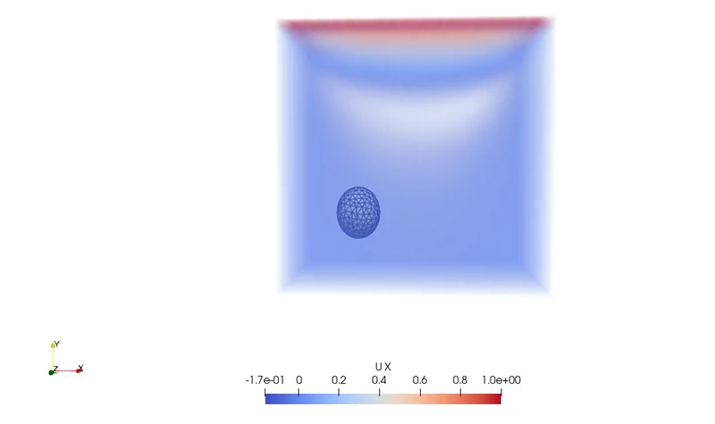

# ofcil3D
OpenFOAM coupled with a 3D FEM code

  

> This repo is a Work in Progress!
This project integrates a Fortran-based 3D solid mechanics solver with OpenFOAM using the Immersed Boundary Method (IBM). It allows for fluid-structure interaction (FSI) simulations of deformable solids in a fluid flow.

## Overview
The standard `icoFoam` solver in OpenFOAM is modified to include a source term from the IBM, which represents the forces exerted by the immersed solid. The solid solver is a custom 3D finite element method (FEM) code written in Fortran. The two solvers are coupled through a shared library, and data is exchanged between them to simulate the FSI.

## Features
- **Fluid-Solid Coupling**: Continuous forcing IBM for FSI.
- **Custom OpenFOAM Solver**: Modified `icoFoam` solver.
- **Interoperability**: Links Fortran and C++ code.
- **3D Simulation**: Designed for 3D FSI simulations.

# Need to run this in the shell before running the solver
export LD_LIBRARY_PATH=/home/divyaprakash/my_solvers/ofcil3D/fem2d:$LD_LIBRARY_PATH
